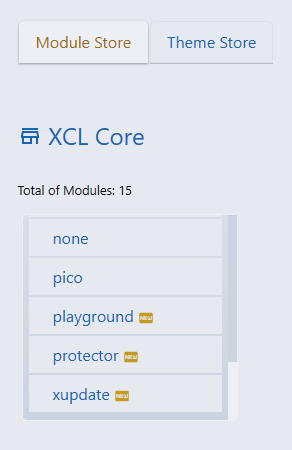

# Get and Deploy Modules
{: .fs-9 }

The easiest and fastest way to expand your web application platform is to get and deploy a module or a preload (single file component). Any installed add-on is displayed with a different color. It is recommended to use the most recent version.  

<svg xmlns="http://www.w3.org/2000/svg" width="24px" height="24px" viewBox="0 0 24 24" style="-ms-transform: rotate(360deg); -webkit-transform: rotate(360deg); transform: rotate(360deg);"><path d="M2 12A10 10 0 1 0 12 2A10 10 0 0 0 2 12m13.6 1.72A4 4 0 0 0 16 12a4 4 0 0 0-4-4v2L8.88 7L12 4v2a6 6 0 0 1 6 6a5.9 5.9 0 0 1-.93 3.19M6 12a5.9 5.9 0 0 1 .93-3.19l1.47 1.47A4 4 0 0 0 8 12a4 4 0 0 0 4 4v-2l3 3l-3 3v-2a6 6 0 0 1-6-6z" fill="currentColor"/></svg>

You are also given the freedom to use older versions if those are necessary for compatibility reasons.   
Beware of potential issues that arise with installing older versions of modules needed. The older versions may not be compatible with the XCL 2.3.x version you have installed.

<h3 class="fs-6 fw-300">XCL Store Modules</h3>

    

        

            
        

        

            <h4>Your own app store</h4>
            
You can get and deploy modules from the public GitHub repository. Public repositories are accessible to everyone on the internet.

            
Or you can create your private repository with customized modules and get your modules from the Store menu of your Update Manager.

            
This procedure works for all types of Store components — modules, preloads, themes — except app services.

        

    

<h3 class="fs-6 fw-300">Downloading and install</h3>

Access the administration Control Panel and click X-Update Manager to extend your Web Application Platform.

Add new features by installing add-ons, modules and preloads (single file component extensions).
 

X-Update Manager allows you to select a Store and to explore content that you can filter and sort in the following ways:

<dl> 
    <dt>Module Name</dt>
    <dd>Alphabetical order</dd>
    <dt>Category</dt>
    <dd>Modules can be organised into categories</dd>
    <dt>Last Update</dt>
    <dd>Based on the last updated date</dd>
    <dt>Version</dt>
    <dd>Higher than 2.3.x are compatibility with future versions</dd>
    <dt>Required Level</dt>
    <dd>Required by the system version, normal or optional</dd>
    <dt>Type</dt>
    <dd>The Web Platform can include various module types. The modules can belong to the subsystem, or they can run independently.</dd>
</dl>

